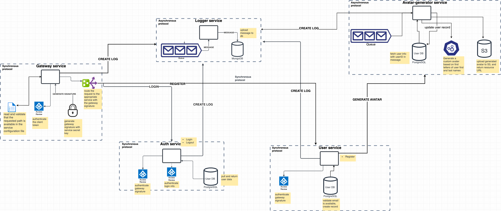

## Basic Microservice Project in Go

This project serves as a basic blog application backend, designed to implement a microservice architecture with various communication design patterns.

### Proposed Architecture 


[Link to Architecture Diagram](https://drive.google.com/file/d/1xaSWEzuC7NARDynK8X6u38MIRKt9ptMt/view?usp=sharing)

### Services

- [Auth (REST)](#auth)
- [User (REST)](#user)
- [Gateway (REST)](#gateway)
- [Logger (Message Queue)](#logger)
- [Avatar Generator (Message Queue)](#avatar-generator)
- [Notification (Pub-Sub)](#notification)
- [Data Retriever (GraphQL)](#data-retriever)
- [Post (REST)](#post)
- [Admin (RPC)](#admin)

## Auth
1. **Login**
   - Verify user information
   - Return JWT token
2. **Forgot Password**
   - Send verification OTP to email
   - Validate OTP and update password

## User
1. **Signup**
   - Connects to database (SQL)
   - Verify user email
   - Store user information
   - Send user ID to Avatar Generator service queue

## Gateway
1. Validate client JWT
2. Route request to appropriate service

## Avatar Generator
1. Generate a custom avatar based on the first letters of the user's first and last names.
2. Upload generated avatar to AWS S3
3. Update user record with avatar URL

## Logger
1. Save logs to database (MongoDB)

## Notification
1. Push Notification
2. Email
3. SMS

## Data Retriever
1. Handles the query of all data with GraphQL

## Post
1. CRUD operations on blog posts
2. CRUD operations on blog comments
3. Clap blog post

## Admin
1. (Description needed)

# Note
To run the gateway locally, update the base URLs of the services in the [conf.yml](https://github.com/ShowBaba/microservice-sample-go/blob/main/gateway-service/conf.yaml) file, e.g., http://auth-service -> http://localhost

# Usage

Run the following command:
```shell
docker-compose build && docker-compose up
```